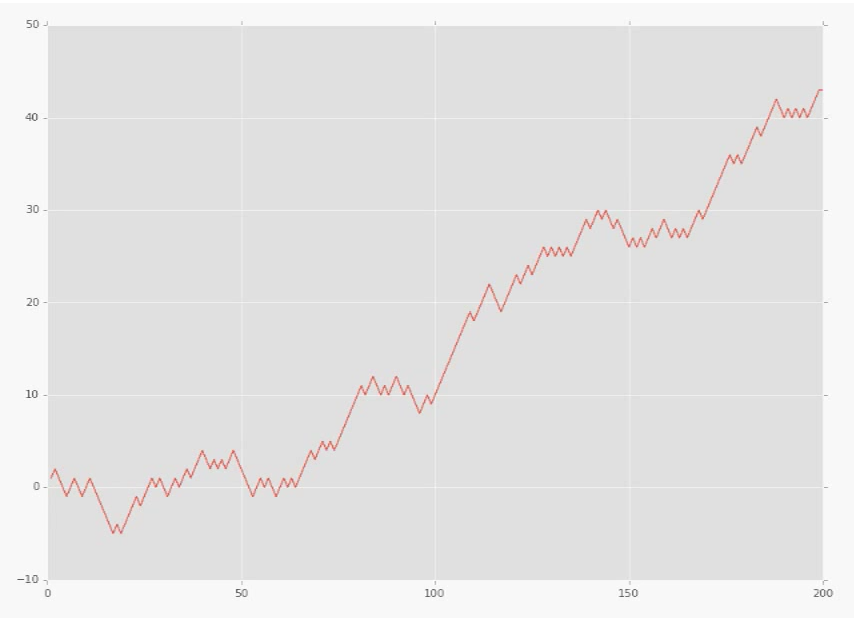

# Twitter_Sentiment_Analysis_and_Graphing
## Twitter Sentiment Analysis using NLTK

**NLTK** is a leading platform for building Python programs to work with human language data. It provides easy-to-use interfaces to over 50 corpora and lexical resources such as WordNet, along with a suite of text processing libraries for classification, tokenization, stemming, tagging, parsing, and semantic reasoning, wrappers for industrial-strength NLP libraries

[Get your Twitter Consumer key, Consumer secret, Access token, Access secret here ](https://apps.twitter.com/)

[To know how to get Twitter access tokens Click Here! ](https://dev.twitter.com/oauth/overview)

The code is divided in 3 set of files

1.First one is just a streaming file twitter_streaming.py {This file contains code only to stream tweets}, remember the stram now is restricted to 3240 tweets only due to permission criteria.

2.Second file streaming.py {This file contains the core code}

3.Third file graphing.py  is the NLTK graphing file for Data Visualisation.

*Check the final output here * 

_The live stream of the sentiments will look like this:_

